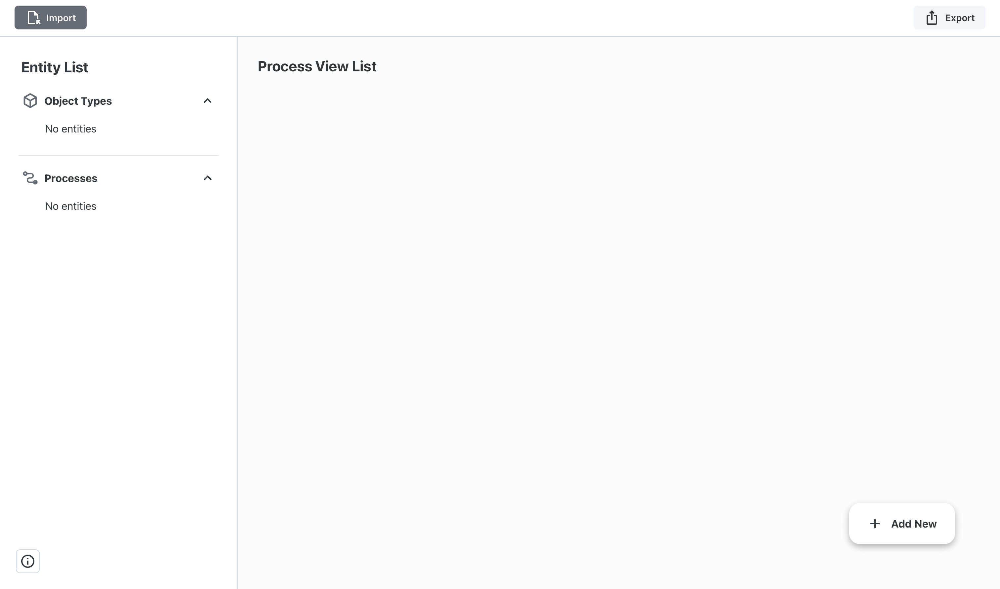
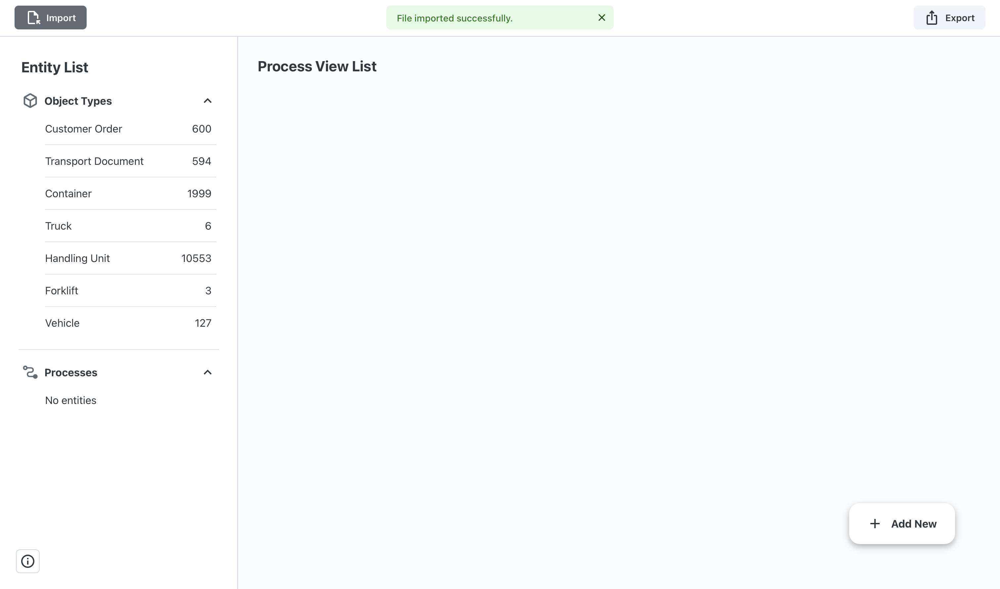
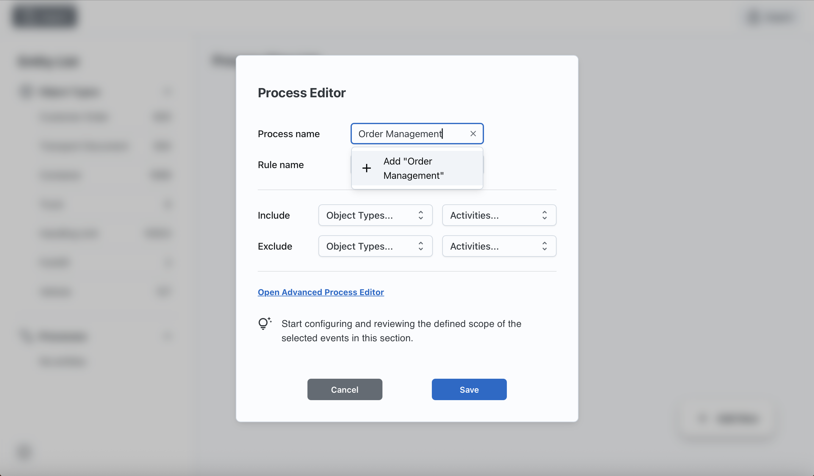
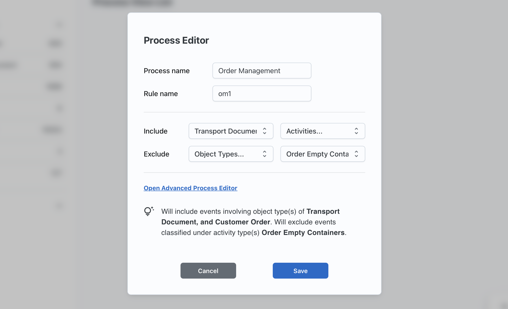
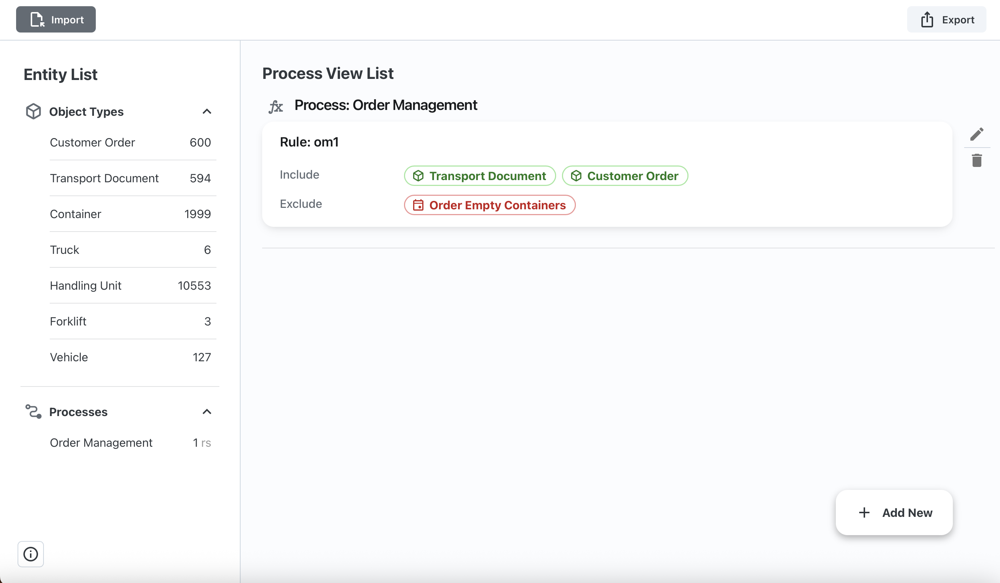

# Getting Started

**Procellar** is a tool for embedding user-defined process scopes into event data, resulting in a process-enriched Object-Centric Event Log (OCEL). It features a clean user interface and an intuitive design that enables users to get started quickly and efficiently.

To begin, follow the steps below.

## Installation and Set Up
### Prerequisties
- [Node.js](https://nodejs.org/) >= 16.x
- [Python](https://www.python.org/) >= 3.8
- [pip](https://pip.pypa.io/en/stable/)

### 1. Clone the Repository
```bash
git clone https://github.com/hudsonjychen/procellar.git
cd procellar
```

### 2. Set Up the Backend
#### Windows
```bash
cd backend
python -m venv venv
venv\Scripts\activate
pip install -r requirements.txt
python run.py
```
#### macOS
```bash
cd backend
python -m venv venv
source venv/bin/activate
pip install -r requirements.txt
python run.py
```

### 3. Set Up the Frontend
Open a new terminal. Go to the location where you clone the project and follow the instructions below to run the frontend.
```bash
cd frontend
npm install
npm run dev
```

## Start Exploring
### Import a File
To begin, import a file into Procellar. Currently, Procellar supports OCEL 2.0 files in JSON format only. Please ensure your file conforms to this standard.

If you’d like to try the tool with example data, you can download sample files from the [OCEL Standard Event Logs](https://ocel-standard.org/event-logs/overview/) page.

Click the Import button located in the top-right corner of the interface.



Once the file is successfully imported:
- The left panel will display a list of entities, including object types and their corresponding counts.
- The process list will also appear, though it will be empty initially.



You can now start defining your own processes to populate the list!

### Creating and Defining a Process
Click the **Add New** button in the bottom right corner to open the **Rule Editor**. Begin by entering a process name and rule name. Use clear and meaningful names—especially for the process name, as it will be embedded in the data and used for subsequent analysis.



Next, define the semantics of the rule using four optional components:
- Include Object Types
- Include Activities
- Exclude Object Types
- Exclude Activities

Each statement supports multiple entities. As you edit these statements, a **summary** is generated below the editor to help you understand the rule's meaning at a glance.

Let’s walk through a quick example. After importing the `ContainerLogistics.json` event data, suppose you want to define a process called *Order Management*. In the editor, enter `Order Management` as the process name and name the first rule `om1`. You want this process to include events involving two object types—`Transport Document` and `Customer Order`—but exclude events with the activity type `Order Empty Containers`. To do this, select the two object types under Include Object Types, and select `Order Empty Containers` under Exclude Activities.



For more details on how each statement works and how they interact, refer to the [Usage Guide](usage-guide.md#rule-editor).

Once you’ve finished editing, click **Save**. Congratulations—you’ve just created your first process and defined its first rule. It will now appear in the **main area**, where your rules are visualized clearly and beautifully using shapes, colors, and labels. You can continue to define more rules and processes, all of which are displayed in the main area.

In the **left panel**, you'll see a list of the processes you've defined. Each process displays the number of associated rules (abbreviated as `rs`) next to its name.



### Best Practices
We recommend two best practices when creating and defining processes:

1. Define each process using a single, comprehensive rule. This means making full use of the four statements mentioned above. This approach promotes clarity and conciseness. For a deep dive, see the Rule Editor section of the [Usage Guide](usage-guide.md#rule-editor).

2. Build your process with multiple simple rules when you need more flexibility. Each rule can contain only one statement or even a single entity. You can then use the Logic Editor to define logical relationships between rules. To open the **Logic Editor**, click the *fx* icon next to the process name in the main area (note: this is only available if the process has more than one rule). See the Logic Editor section of the [Usage Guide](usage-guide.md#logic-editor) for more information.

### Exporting Your Process Definitions
Once you’ve finished defining your processes, click the Export button in the top right corner. This will download a `.zip` file to your computer, which includes:

- `definition-file.json`: contains the process rules you defined
- `process-enriched-ocel.json`: the OCEL file with embedded process information

You can now use our companion tool, [Business Execution Graph](https://github.com/hudsonjychen/business-execution-graph), to explore interactions between processes!

