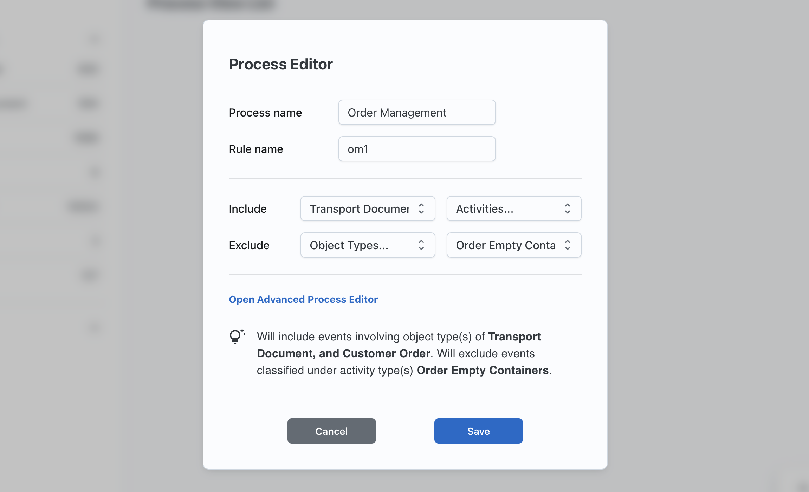

# Usage Guide
This page provides detailed instructions for using **Procellar**, helping you fully understand its interface and features.

## Interface Overview
The Procellar interface consists of three main parts: the **header**, the **left panel**, and the **main area**.

In the header, you can import or export files using the respective buttons.

The left panel displays:
- A list of object types with their instance counts.
- A list of processes with the number of associated rules (rs).

An information icon at the bottom-left corner, which shows file details (name, size, upload time) on hover.

The **main area** visualizes all defined processes. Each rule is shown as a card, summarizing included or excluded entities and any advanced filtering conditions.
Next to each rule card, you’ll find an action button group:
- Click the pen icon to edit the rule.
- Click the trash icon to delete it (note: *deletions are irreversible*).

## Rule Editor
The Rule Editor is the core feature of **Procellar**. Click the **Add New** button in the bottom-right corner to open it.

There are two modes: **Basic** (default) and **Advanced**.

In Basic Mode, you can define up to four optional statements:
- Include Object Types
- Include Activities
- Exclude Object Types
- Exclude Activities

To save a rule, you must:
- Provide a process name.
- Provide a unique rule name (within that process).
- Define at least one statement.

### Statement Semantics
Let’s walk through an example:
You’re defining a process called `Order Management` and its rule, `om1`. You want to include events related to both `Transport Document` and `Customer Order` object types. This means the rule matches events associated with all specified object types — not just one.
The same logic applies to Exclude Object Types, but used for filtering out such events.

For activities, the logic is inclusive `OR`. For example, if you exclude both `Order Empty Containers` and `Pick Up Empty Container`, the rule will exclude any event that matches either event type.

### Statement Interaction
Include statements (object types and activities) define the initial event scope. Their relationship is `OR` — an event only needs to match one include statement to be selected. If no include statements are defined, all events are initially included.

Exclude statements apply to the included event set. Their relationship is also `OR` — if an event matches any exclude statement, it is removed. If no exclude statements are defined, nothing is excluded.

### Advanced Mode
Click **Open Advanced Process Editor** to switch to advanced mode.

This interface adds condition editors to the basic structure. You can:
- Add conditions with the plus icon
- Remove conditions with the trash icon

Each condition includes:
- **Entity**
- **Attribute**
- **Operator**
- **Value**

After selecting entities via statements, you can define conditions for their attributes. Operators are type-sensitive—for example: For string attributes, availabel operators are `equals`, `not equals`, `in`, `not in`. `in` and `not in` allow specifying a list of values

Each condition is attached to a statement. A statement is only effective when its condition(s) are satisfied.

## Logic Editor
Click the *fx* icon next to a process name in the main area to open the **Logic Editor**.

This tool lets you define complex logical relationships among rules within a process. It is enabled only when you define more than one rule for a process.

How it works:
- The editor starts with a **root level** and two default **groups**: `group1` and `group2`.
- Click a group to assign rules to it.
- Rules not assigned to the first group are automatically assigned to the second.
- If a group contains only one rule, it becomes a fixed label and is renamed to that rule’s name.
- If a group has two or more rules, it becomes a new **logic level**, and two **subgroups** are created.
- Labels (**green = assigned, blue = unassigned**) reflect the completion status.
- When all labels are green, you can save.

Each level has a logic operator selector (`AND` / `OR`). The resulting expression is shown dynamically at the bottom.
Click **Clear** to reset the logic editor (this action cannot be undone).

## Further Reading
- [Getting Started](getting-started.md)